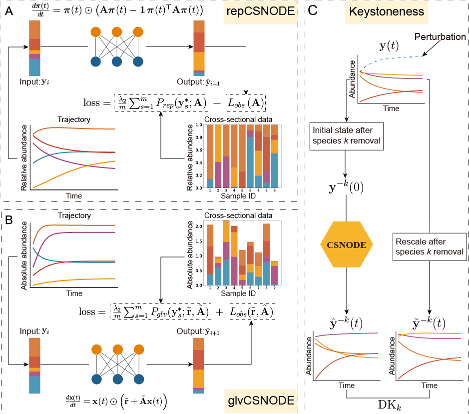

# CSNODE

## cross-sectional data-informed NeuralODE



## Overview of the CSNODE framework and the dynamic keystoneness metric
Understanding the dynamics of host-associated microbial ecosystems is crucial for developing therapeutic strategies to modulate the microbiota. However, this effort is often hindered by sparse and weakly informative microbiome time-series data. To address this challenge, we propose a cross-sectional data-informed Neural Ordinary Differential Equations (NeuralODE) framework that integrates cross-sectional data into dynamic modeling. We also introduce a dynamic keystoneness metric to comprehensively quantify species importance. The proposed methodology is systematically validated on both simulated and experimental datasets. Our results show that the enhanced NeuralODE framework substantially improves prediction accuracy compared with models that do not incorporate cross-sectional data, and that the dynamic keystoneness metric is highly sensitive to perturbations. Overall, integrating time-series data with cross-sectional data provides deeper insights into microbial community dynamics and lays the foundation for more effective interventions in these complex ecosystems. 


## Installation

To set up the environment, use the provided conda environment file:

```bash
conda env create -f environment.yml
conda activate csnode
```

## Usage

This repository provides simulation examples for both GLV-CSNODE and Rep-CSNODE frameworks:

- **`glvCSNODE/`**: Contains simulation examples using the Generalized Lotka-Volterra (GLV) model with cross-sectional data-informed NeuralODE
- **`repCSNODE/`**: Contains simulation examples using the Replicator dynamics model with cross-sectional data-informed NeuralODE

Each directory includes:
- Scripts for model training
- R scripts for keystoneness analysis
- Example datasets and results

To run the simulations, navigate to the respective directory and follow the scripts in the `simulation/` folder.